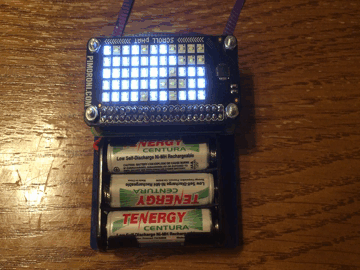

# Raspberry Pi 0/Scroll pHAT badge

This is a battery-powered badge that repeated scrolls words on a Scroll pHAT.

Parts list:
* Raspberry Pi Zero
* MicroSD card (with the image built by `rpi0_badge_defconfig` on it)
* [Scroll pHAT](https://shop.pimoroni.com/products/scroll-phat)
* [3-AAA Battery Holder](https://www.pololu.com/product/1144)
* [Pololu 5V Step-Up Voltage Regulator U3V12F5](https://www.pololu.com/product/2115)
* [M2.5 11mm hex standoffs](https://www.pololu.com/product/1952)
* M2.5 screws and nuts
* 3 mm spacer
* Laser cut acrylic back -> [.dxf](scroll-badge.dxf)
* 3 AAA NiMH batteries (should be relatively high capacity)
* Ribbon or other material for a neck strap

The 5V regulator was wired to the Raspberry Pi and the battery. We then taped it to
the back of the Pi Zero. The Pi Zero and the Scroll pHAT were then screwed down
to the acrylic. The short spacers were needed to allow clearance for the
regulator and the through-hole GPIO connector.

Even though we made holes for the battery holder, we ended up using a wire to
tie it to the back. That was due to lack of proper screws.

The holes at the top of the acryplic piece are for the neck strap.

The software image is configured to provide a shell prompt through the USB port.
To use it, take the batteries out and connect the RPi 0 to your laptop via a
MicroUSB cable. Open up the serial port and log in as "root" with password
"root".

We did a simple power measurement and found that the whole device was taking
about 500 mW. AAA batteries don't have that much capacity so make sure that you
have 900 mAh ones or better. Ours worked plenty well to experiment and show it
off.

